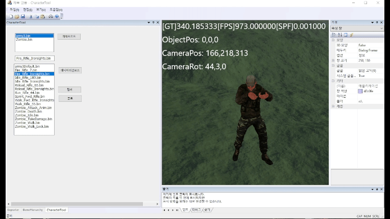
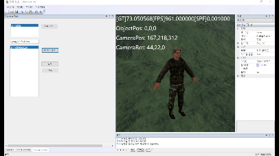
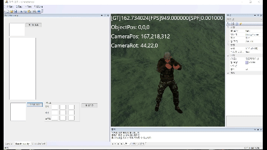
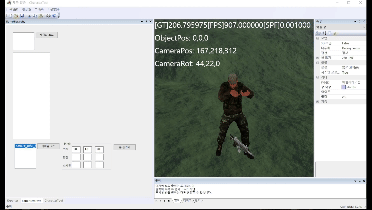
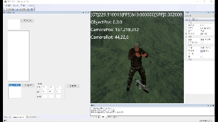
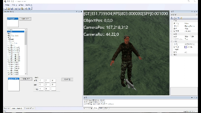
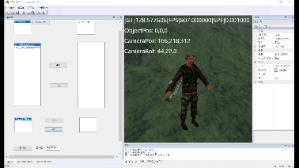
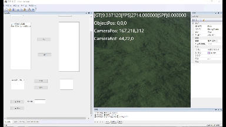

# CharacterTool
* MFC(Microsoft Foundation Class)를 이용해서 만든 캐릭터 툴
* 다운로드 : <https://naver.me/Fy24JUn2>
  

***

* 작업 기간 : 2023. 11. 06 ~ 2024. 01. 07 (2개월)
* 인력 구성 : 1명
* 사용언어 및 개발환경 : MFC, DirectX11, C++

# Model View
* 캐릭터를 자작으로 만든 FBX Loader로 불필요한 정보를 제외하고 바이너리 파일로 변환
* 바이너리 파일에서 정점과 본 정보를 불러와 파이프라인을 거쳐 화면에 보여줌

***

* 캐릭터 불러오기

* 애니메이션 불러오기

# Item Load
* 바이너리로 된 아이템 파일을 불러옴

# Transform
* 엔진에 있는 transform 기능을 흉내를 내서 제작
* 물체의 이동, 회전, 스케일 변환이 가능

***

* 이동

* 회전

* 스케일

# Socket
* 캐릭터의 본을 부모로 해서 캐릭터 본의 위치를 아이템이 따라다니게 제작

# Character Form
* 현재 있는 캐릭터와 아이템의 종류 위치를 저장하고 로드

***

* 저장

* 로드

